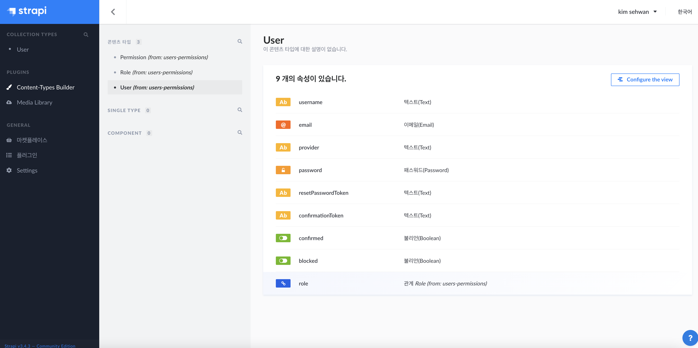

# Strapi CMS를 활용한 백엔드 구축

- Headless CMS

- UI구성이나, 프론트엔드 구축은 직접 해야하지만 간단한 CRUD 구현은 이미 되어있는 CMS.

- Headless란?
    - UI가 없이, 핵심 로직만 포함되어있다는 의미.
    - UI, 미들웨어, 비즈니스로직만 구현하고
    - 백엔드 API는 Strapi가 제공해줌

- Strapi는 MIT 라이선스
    - 이 소프트웨어를 누구라도 무상으로 제한없이 취급해도 좋다. 단, 저작권 표시 및 이 허가 표시를 소프트웨어의 모든 복제물 또는 중요한 부분에 기재해야 한다.
    - 저자 또는 저작권자는 소프트웨어에 관해서 아무런 책임을 지지 않는다.

- 즉 맘대로 지지고 볶아도 좋다.




- Content Type Builder 로 컨텐츠 타입을 정하고 사용 가능하다.


## 고민해볼 점

- 모든 콘텐츠나 API를 생성하고 관리하는것을 UI 기반으로 가능하며.
- API 호출 및 컨텐츠 관리 외에 영역을 개발자가 개발하면 되기 떄문에 매우 편리하고 빠르다.

- 운영배포를 하기 위해서는 Nginx나 pm2에 배포를 해야하고, Reverse Proxying 필수. (80 -> 1337)

### 기타 설정

- DB 설정은 다음애 있다.
    - `config/database.js`

```js
module.exports = ({ env }) => ({
  defaultConnection: 'default',
  connections: {
    default: {
      connector: 'bookshelf',
      settings: {
        client: 'sqlite',
        filename: env('DATABASE_FILENAME', '.tmp/data.db'),
      },
      options: {
        useNullAsDefault: true,
      },
    },
  },
});
```

- 여기서 사용하기 위한 DB를 정의하면 되며
- 만약 Docker를 이용해 운영에 배포를 했다?
    - Docker Compose를 이용해 컨테이너 내 데이터들이 재배포시 휘발되지 않도록 사용해야 한다.

- 다음과 같이 `docker-compose.yaml` 파일을 작성한다

```yml
version: '3'
services:
  strapi:
    image: strapi/strapi
    environment:
      DATABASE_CLIENT: mysql
      DATABASE_HOST: mysql
      DATABASE_PORT: 3306
      DATABASE_NAME: strapi
      DATABASE_USERNAME: strapi
      DATABASE_PASSWORD: strapi
      DATABASE_SSL: 'false'
    volumes:
      - ./app:/srv/app
    ports:
      - '1337:1337'
    depends_on:
      - mysql

  mysql:
    image: mysql
    command: mysqld --default-authentication-plugin=mysql_native_password
    volumes:
      - ./data:/var/lib/mysql
    environment:
      MYSQL_ROOT_PASSWORD: strapi
      MYSQL_DATABASE: strapi
      MYSQL_USER: strapi
      MYSQL_PASSWORD: strapi
```

- 이후에
    - docker-compose pull
    - docker-compose up -d

- 커스텀 비지니스 로직 혹은 미들웨어를 작성하기 위해서는
    - `api/{모델명}/config`
    - `api/{모델명}/controllers`
    - `api/{모델명}/models`
    - `api/{모델명}/services`

- 코드를 수정하면 된다. 자세한 내용은 공식 문서를 참고해야 할듯.

### 커스텀 컨트롤러
